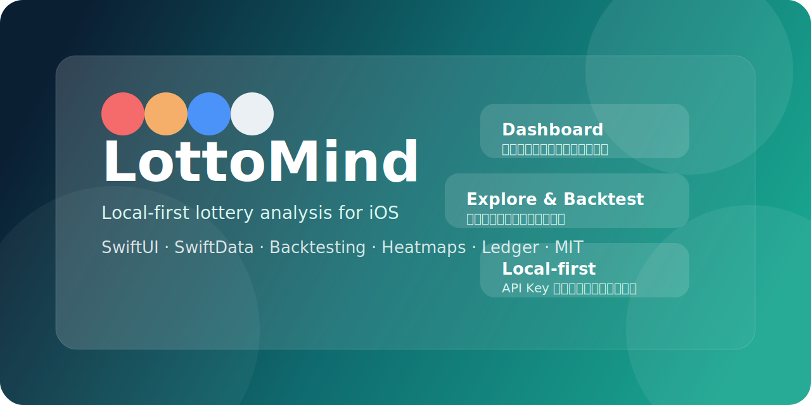

<p align="center">
  <a href="./README.md"><strong>简体中文</strong></a> · <a href="./README.en.md"><strong>English</strong></a>
</p>

<p align="center">
  
</p>

<p align="center">
  <a href="https://github.com/fitclaw/Lottomind/actions/workflows/ci.yml"></a>
  <a href="https://github.com/fitclaw/Lottomind/blob/main/LICENSE"></a>
  
  
</p>

<p align="center">
  一款本地优先、面向 iOS 17+ 的彩票历史数据分析实验应用。<br />
  抓取开奖、冷热号探索、历史回测和账本管理都在一套 SwiftUI App 内完成。
</p>

# LottoMind

`LottoMind` 是一个面向 iOS 17+ 的彩票历史数据分析实验项目，提供开奖抓取、统计分析、历史回测、冷热号探索和本地购彩账本能力。

## 仓库定位

- 使用 `MIT` 许可证
- 默认不包含仓库级 API Key、密码或个人联系信息
- API Key 与业务数据默认仅保存在本机
- 不包含代购彩票能力，也不隶属于任何官方彩票发行机构
- 中文友好，同时为英文协作者提供对应入口

## 功能概览

- 首页仪表盘：展示最新开奖、推荐号码和奖池压力指数
- 分析页：展示多模块评分、说明文案和推荐详情
- 探索页：查看冷热号、热力图和时间范围变化
- 回测页：查看历史命中率和策略表现
- 账本页：记录手动录入的购彩成本与开奖结果
- 设置页：配置默认彩种、通知、本地数据清理与 AI API Key

## 项目亮点

- 本地优先：账号、账本和推荐结果不依赖私有后端
- 多模块算法：热号回避、奖池压力、序列衰减、组合结构、异常检测与融合评分
- 开箱协作：MIT、CI、Issue 模板、PR 模板、Support 与 Release 配置齐全
- 公开发布友好：仓库内不包含密钥、个人联系信息和内部工作流文档

## 技术栈

- SwiftUI
- SwiftData
- BackgroundTasks
- UserNotifications
- XCTest / Testing

## 数据与隐私

- 本项目不自带后端，也不通过自建服务器转发请求。
- 用户输入的 API Key 默认只保存在本机 Keychain。
- 当你主动执行联网同步时，请求会直接发送到你选择的 AI 服务商接口。
- 开奖数据抓取依赖外部 AI 服务和公开网络搜索能力，结果可能存在延迟或误差。

更多说明见 [使用边界 / Responsible Use](./docs/RESPONSIBLE_USE.md)。

## 快速开始

1. 使用 Xcode 16 或更新版本打开 `Lottomind/Lottomind.xcodeproj`。
2. 选择 iOS 17+ 模拟器，或在真机上为 App Target 配置你自己的 Development Team。
3. 运行 App。
4. 如需联网拉取开奖信息，在“设置”页填入你自己的 AI API Key。

## 测试

在命令行中可以使用：

```bash
xcodebuild test \
  -project Lottomind/Lottomind.xcodeproj \
  -scheme Lottomind \
  -destination 'platform=iOS Simulator,name=iPhone 16' \
  CODE_SIGNING_ALLOWED=NO
```

如果本机没有 `iPhone 16` 模拟器，请替换为任意可用的 iOS 17+ iPhone 模拟器。

默认共享 Scheme 当前只包含稳定的单元测试。`LottomindUITests` 目标仍保留在项目中，适合在本地 Xcode 会话里按需运行和继续完善。

## 快速链接

- English README: [README.en.md](./README.en.md)
- 架构说明： [docs/ARCHITECTURE.md](./docs/ARCHITECTURE.md)
- 开发说明： [docs/DEVELOPMENT.md](./docs/DEVELOPMENT.md)
- 使用边界： [docs/RESPONSIBLE_USE.md](./docs/RESPONSIBLE_USE.md)
- 获取帮助： [SUPPORT.md](./SUPPORT.md)
- 贡献指南： [CONTRIBUTING.md](./CONTRIBUTING.md)
- 安全策略： [SECURITY.md](./SECURITY.md)
- 行为准则： [CODE_OF_CONDUCT.md](./CODE_OF_CONDUCT.md)
- 变更记录： [CHANGELOG.md](./CHANGELOG.md)

## 项目结构

```text
Lottomind/
  Lottomind/            # App 源码、资源、SwiftData 模型
  LottomindTests/       # 单元测试
  LottomindUITests/     # UI 测试
  docs/                 # 面向开源协作者的文档
```

## 协作说明

- Issue 和 PR 可以使用中文或英文
- 文档允许中英混写，但请优先保证清晰、准确和可维护
- 如果内容涉及合规、隐私或安全，请优先在对应模板中说明上下文

## 已知限制

- 当前版本仍依赖通用 AI 接口抓取开奖数据，并非官方数据源 SDK。
- 背景刷新受 iOS 系统调度策略影响，不能保证严格准时。
- 推荐结果只用于历史统计分析和界面演示，不应被视为收益承诺或预测服务。
